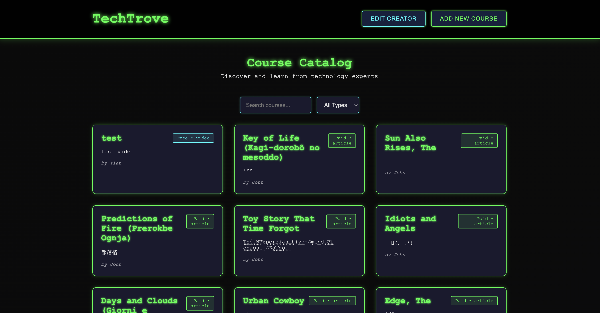

# TechTrove

A Community-Driven Learning Platform

## Description

TechTrove is a web platform designed to bridge the gap between aspiring learners and experienced tech professionals. The platform allows creators to publish educational content and learners to discover and learn from this content.

## Author

Yian Zhou

## Class link

[class link](https://northeastern.instructure.com/courses/225993)

## Screenshot



## Features

- Public Course Catalog
- Course Management (CRUD operations)
- Creator Management (CRUD operations)
- Course Detail Pages

## Technology Stack

- **Backend**: Node.js, Express.js
- **Database**: MongoDB
- **Frontend**: Vanilla HTML5, CSS3, JavaScript
- **Architecture**: Single Page Application with RESTful API

## Project Structure

```json
TechTrove/
├── static/                # Frontend files
│   ├── css/               # Stylesheets
│   ├── js/                # JavaScript files
│   │   ├── components/    # UI components
├── server/                # Backend files
│   ├── db/                # database implements
│   ├── models/            # Data models
│   ├── routes/            # API routes
└── app.js                 # Main application file
```

## API Endpoints

### Courses

- `GET /api/courses` - Get all courses
- `GET /api/courses/:id` - Get single course
- `POST /api/courses` - Create new course
- `PUT /api/courses/:id` - Update course
- `DELETE /api/courses/:id` - Delete course

### Creators

- `GET /api/creators` - Get all creators
- `POST /api/creators` - Create new creator
- `PUT /api/creators/:id` - Update creator
- `DELETE /api/creators/:id` - Delete creator

## Database Collections

### creators

```json
{
  "_id": "ObjectId('...')",
  "name": "Yian",
  "title": "Senior Software Engineer at TechCorp",
  "bio": "Expert in cloud computing...",
  "createdAt": "ISODate('...')"
}
```

### courses

```json
{
  "_id": "ObjectId('...')",
  "creatorName": "Yian",
  "title": "Mastering Node.js for Beginners",
  "description": "A comprehensive video series...",
  "contentType": "video",
  "isFree": true,
  "content": "https://www.youtube.com/...",
  "createAt": "ISODate('...')"
}
```

## To-Do List

- [ ] Implement `PUT /api/creators/:id` route for updating a creator.
- [ ] Implement `DELETE /api/creators/:id` route for deleting a creator.
